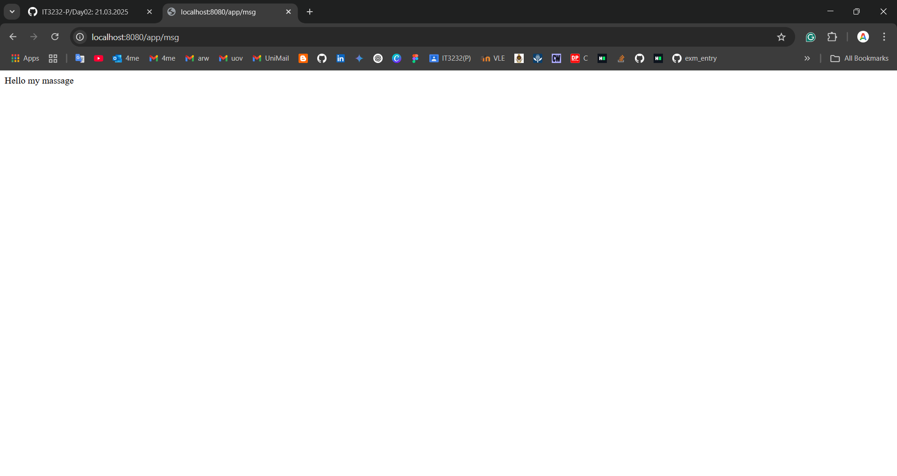
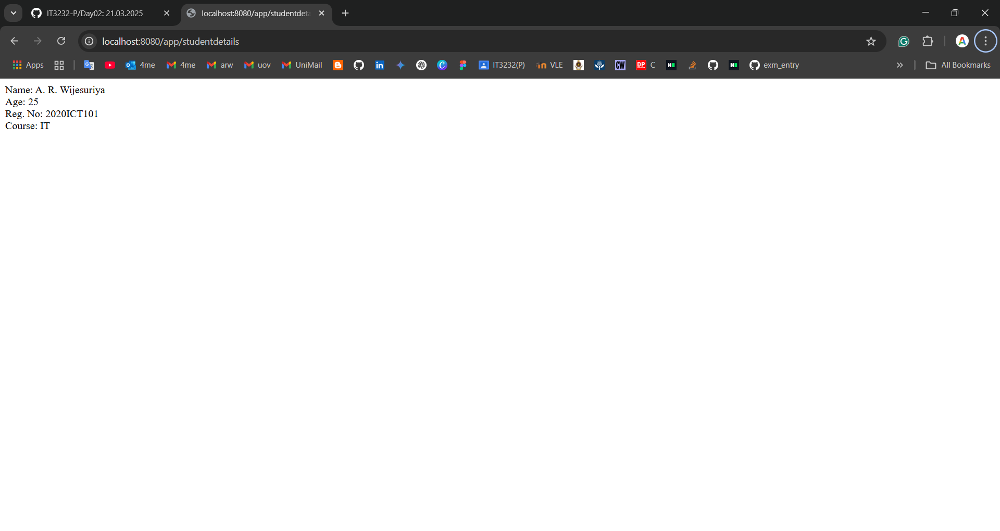

## 2020ICT101
### Practical Date: 21.03.2025
### Practical Number: 02
### Problem Specification: Basic REST API endpoints that return text responses

This project demonstrates a simple Spring Boot web service application created on March 21, 2025. The application provides basic REST API endpoints that return text responses.

#### Project Structure
    - AppController.java - Contains basic greeting endpoints
    - Output1.png, Output2.png, Output3.png - Screenshots showing endpoint responses

### Output

